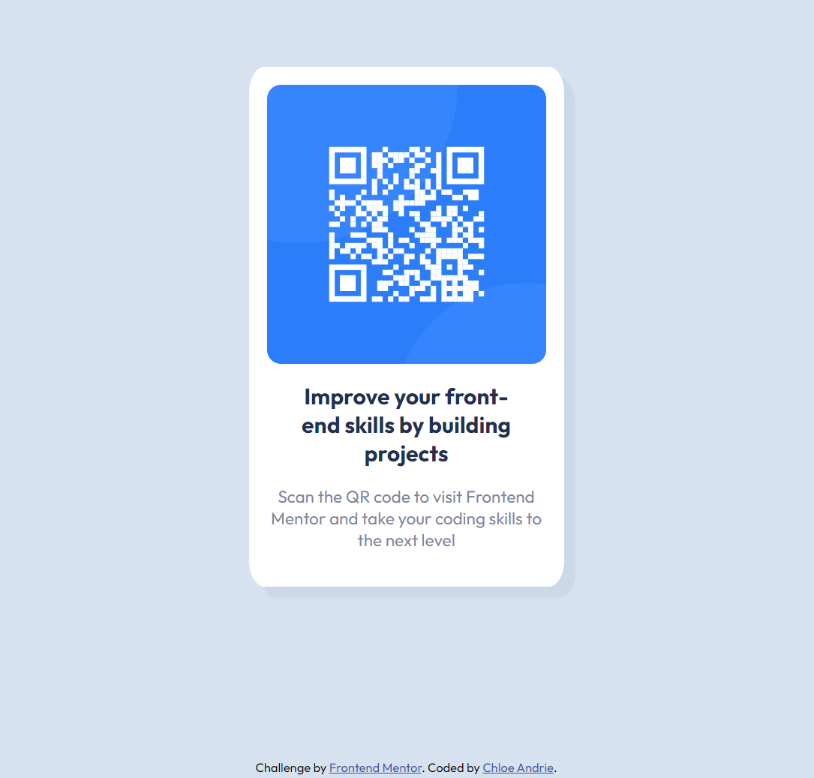

# Frontend Mentor - QR code component solution

This is a solution to the [QR code component challenge on Frontend Mentor](https://www.frontendmentor.io/challenges/qr-code-component-iux_sIO_H). Frontend Mentor challenges help you improve your coding skills by building realistic projects.

## Table of contents

- [Overview](#overview)
  - [Screenshot](#screenshot)
- [My process](#my-process)
  - [Built with](#built-with)
  - [What I learned](#what-i-learned)
  - [Continued development](#continued-development)
- [Acknowledgments](#acknowledgments)

## Overview

### Screenshot

## My process

### Built with

- Semantic HTML5 markup
- CSS custom properties
- Mobile-first workflow

### What I learned

When first learning CSS, I immediately jumped to Flexbox and Grid to create responsive layouts. Starting this challenge, I focused on working with the browser's natural responsiveness - not fighting it with lots of wrappers, containers, flexbox, grid, and/or media queries. I think I got pretty close on my first Frontend Mentor Challenge.

### Continued development

I'm so excited to become a more efficient, effective web developer. Looking forward to more challenges and fun projects!

## Acknowledgments

Thank you to Frontend Mentor for the first challenge!
